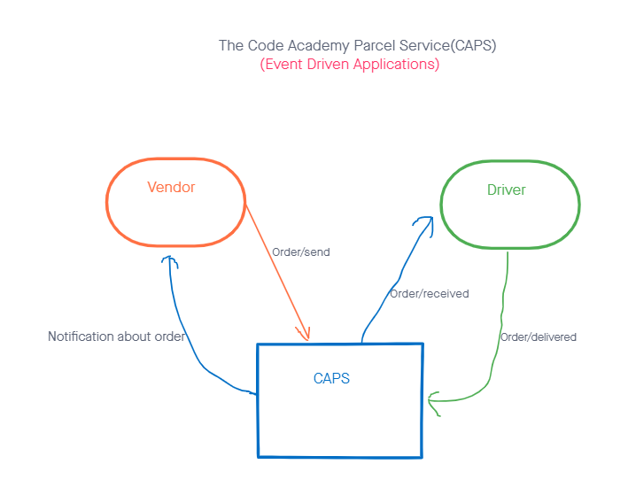
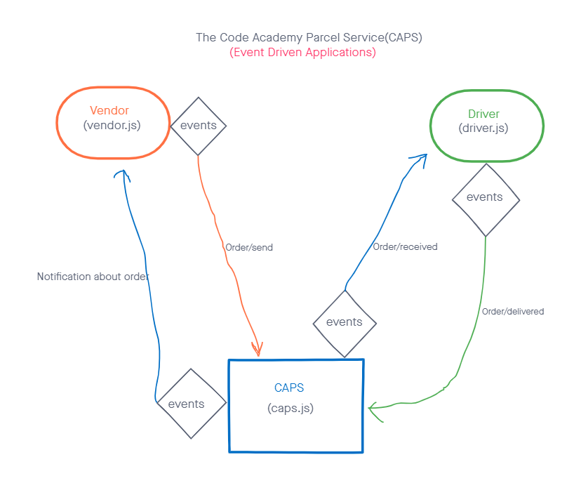
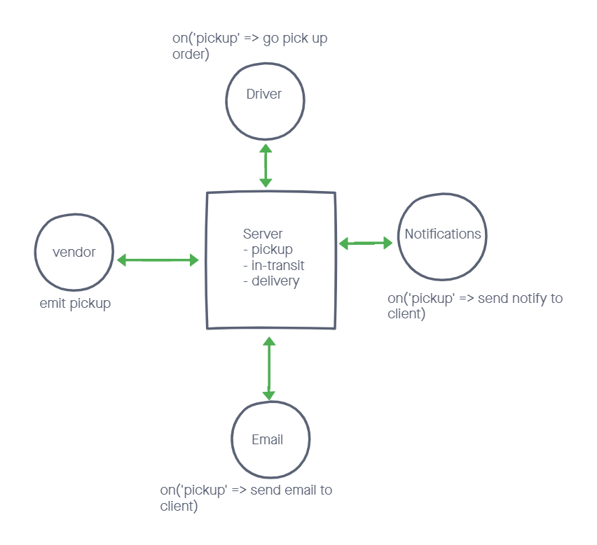
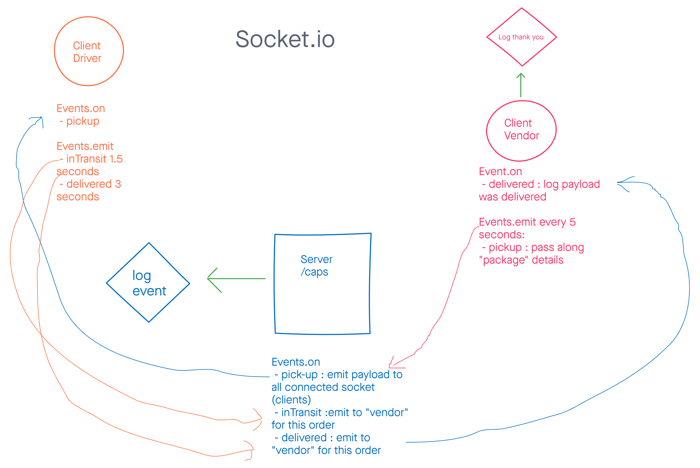

# CAPS

## Name: Louis Lassegue

## Phase 1 Requirements: Events

  - Our goal is to setup a system of events and handlers, with the intent being to change out the eventing system as we go, but keeping the handlers themselves largely the same. The task of “delivering a package” doesn’t change (the handler), even if the mechanism for triggering that task (the event) does.

### Setup

Major functionality for this phase of the project.

- As a vendor, I want to alert the system when I have a package to be picked up

- As a driver, I want to be notified when there is a package to be delivered

- As a driver, I want to alert the system when I have picked up a package and it is in transit

- As a driver, I want to alert the system when a package has been delivered

- As a vendor, I want to be notified when my package has been delivered

- As developer, I want to use industry standards for managing the state of each package

- As a developer, I want to create an event driven system so that I can write code that happens in response to events, in real time

#### ENV Requirements

- none

#### Running the App

- use node in terminal to run console.logs 

## UML

## Links

## Phase 2 Requirements: Socket.io

  - In Phase 2, we’ll be changing the underlying networking implementation of our CAPS system from using node events to using a library called socket.io so that we can do networked events. Socket.io manages the connection pool for us, makes broadcasting much easier to operate, and works well both on the terminal (between servers) and with web clients.

### Setup

The core functionality we’ve already built remains the same. The difference in this phase is that we’ll be creating a networking layer. As such, the user stories that speak to application functionality remain unchanged, but a new set theme emerges to get us through the refactoring.

- As a vendor, I want to alert the system when I have a package to be picked up

- As a driver, I want to be notified when there is a package to be delivered

- As a driver, I want to alert the system when I have picked up a package and it is in transit

- As a driver, I want to alert the system when a package has been delivered

- As a vendor, I want to be notified when my package has been delivered

#### ENV Requirements

- none

#### Running the App

- use node in terminal to run console.logs 

## UML

## Links
